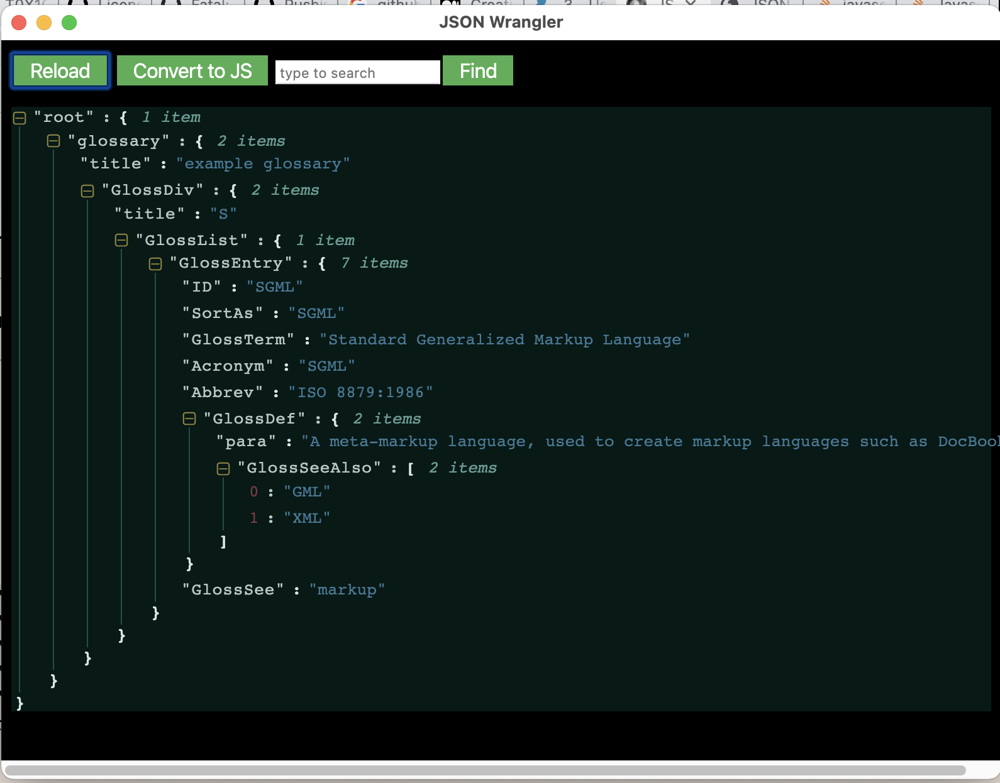

# Json Wrangler

## What's it do ?
Ever grabbed some unformatted json from a log or from the chrome network tab 
and it is unreadable ? You need **Json Wrangler** :-) Simply copy the unformatted
json, then load it up and the json will be displayed nicely formatted 
in an electron window. Works even better if you launch Json Wrangler via
a keyboard shortcut.  

  

## How to use
The following instructions are for running on intel mac OSX 
(no idea if it works on apple silicon). You can also build for windows
and linux but I haven't been able to test those as yet
* get latest version of node
* yarn
* yarn dist
* copy json-wrangler-x.x.x.dmg from dist directory to somewhere, double click it
and copy to your Applications
* open OSX Automator and create a new Quick Action. 
* In the quick action config add Launch Application as an action and 
select json-wrangler.app as the application
* save the quick action
* go into apple system prefs keyboard shortcuts. Click Services in the left section and add a
shortcut. I use shift-option-command-J (this part may require restarting of 
  your mac).
* now when you copy some json to the clipboard and type shift-option-command-J
Json Wrangler will load in a chrome/electron window.  
  
## How to develop
If you want to develop the app yourself 
* clone the repo
* yarn
* yarn dev. This will run webpack-dev-server and you can change the 
react app however you want. Note the json display is provided courtesy
of [react-json-view](https://www.npmjs.com/package/react-json-view)
  
